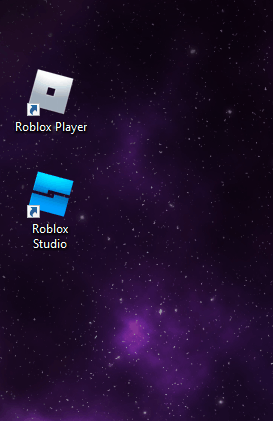
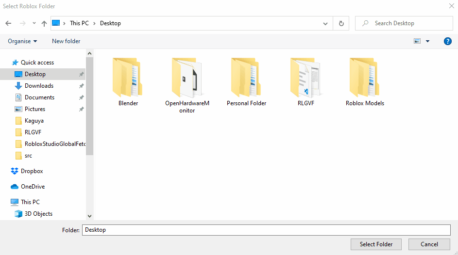
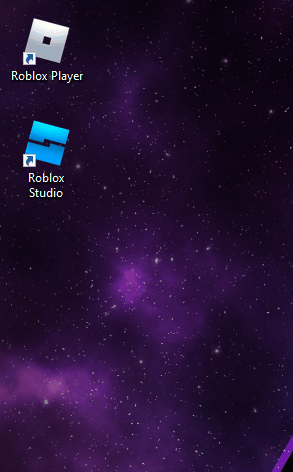
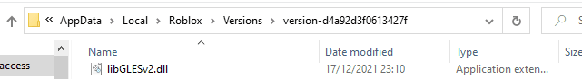
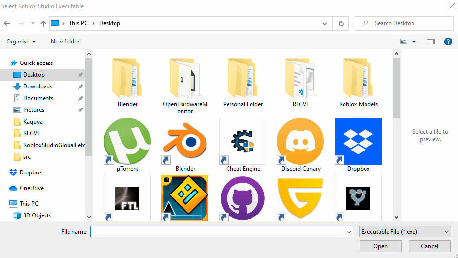
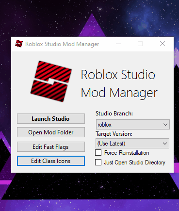
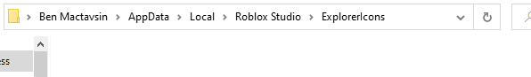
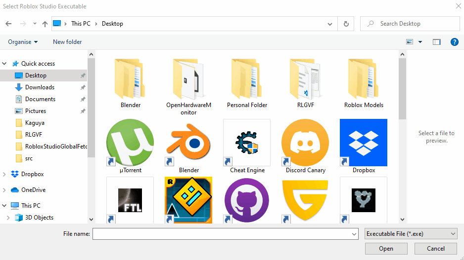

# Roblox Luau Global Variable Fetcher

A barebone implementation of searching ASCII strings in Roblox Studio executable to create a list of possible built-in Luau globals.

# Why does this exist?

Recently, I was creating a list of Luau globals every version update manualy to update another repository and doing the entire process by hand by hand was starting to become irritating. 

So I search the internet and found [matthewdean's implementation](https://github.com/matthewdean/roblox-global-variable-enumerator) on the matter. 

However, despite trying quite a bit, I couldn't get his code working and there were a few other thing with his implementation that made me uncomfortable:

1. Source code included an executable file named `Strings.exe` that I couldn't find the actual source code for.

2. It was last updated back in 2015. Which means it was rather unlikely that author was going to update it anytime soon.

So with these facts in mind, I decided to write one for myself. After writing the program, I decided to make the program public so everyone can benefit from it for it's rather niche use case.

# How to download it?

You can go to the released tab and \*download the executable file from the latest stable release.

(You can also download the pre-release one (If there is one.) if you're feeling a little bit more brave.)

* You can also copy the source code from `src` folder and build the executable yourself if you know how to do so.

# How do I use it?
## Notice: 
This program requires .NET 6 or higher to run as intended. To download runtime files to run .NET 6 programs, go to this link down below:
https://dotnet.microsoft.com/en-us/download/dotnet/6.0/runtime

While the program is running, it's highly recommended that you keep the Roblox Studio closed and not interfere when program opens it automatically unless program throws an error or closes unexpectedly. 

If former throws an error that starts with "`Program exited unexpectedly with error`" or the latter happens, please go to the [Github Issues Page](https://github.com/Mactavsin/Roblox-Luau-Global-Variable-Fetcher/issues) or [Roblox Devforum post](https://devforum.roblox.com/t/v12-roblox-luau-global-variable-fetcher/1592480) and report the error to me with details of the error and reproduction steps.

Program also can miss some of the globals in the final result if they only exist on `AutocompleteMetadata.xml` XML file. This is being planned to be fixed on `v2.0`.

## Process:

Run the `RLGVF.exe`. You will be met with 3 different `CommonDialog`s:

>1. Roblox folder `FolderBrowserDialog`: You will have to provide directory to the Roblox folder.
>
>>To get directory to the Roblox folder:
>>
>>1. Right click `Roblox Player` shortcut on your desktop and click "Open File Location" button.
>>
>>
>>
>>2. Navigate back to "Roblox" folder in address bar and copy address as text.
>>
>>
>>
>>3. Paste the address to `FolderBrowserDialog`'s address bar and press "Select Folder".
>>
>>
>>
>
>2. Roblox Studio Executable `OpenFileDialog`: You will have to provide directory to the Roblox Studio Executable file.
>
>>To get directory to the Roblox Studio Executable file:
>>>For people that use unmodified version of Roblox Studio:
>>>
>>>1. Right click `Roblox Studio` shortcut on your desktop and click "Open File Location" button.
>>>
>>>
>>>
>>>2. Copy address as text on address bar.
>>>
>>>
>>>
>>>3. Paste the address to `OpenFileDialog`'s address bar and select `RobloxStudioBeta.exe`.
>>>
>>>
>>>
>>
>>>For people that use [MaximumADHD's Roblox Studio Mod Manager](https://github.com/MaximumADHD/Roblox-Studio-Mod-Manager):
>>>
>>>1. Run `RobloxStudioModManager.exe` on your desktop and navigate through "Edit Class Icons">"Open Icon Folder" buttons.
>>>
>>>
>>>
>>>2. Navigate back to "Roblox Studio" folder in address bar and copy address as text.
>>>
>>>
>>>
>>>3. Paste the address to `OpenFileDialog`'s address bar and select `RobloxStudioBeta.exe`.
>>>
>>>
>>>
>>
>3. Save file `SaveFileDialog`: You will have to provide directory for program to save the final result into. You can select anywhere you like.

After doing all of the above, program will start operations. Program will output "`List is saved to directory: {SaveFileDirectory}`" if operations completed successfuly and it will be safe to exit the program. You can view the final result by viewing the save file.

# Can I create issues/pull request?

Yes. You can post your bugs and suggestions in issues tab. You can also propose changes by creating a pull request. You can ask questions about the program by directly messaging me or on Roblox Devforum Post down below.

# Links
Repository Page: https://github.com/Mactavsin/Roblox-Studio-Global-Variable-Fetcher

Roblox Devforum Post: https://devforum.roblox.com/t/v12-roblox-luau-global-variable-fetcher/1592480

My Twitter (To ask questions about the program directly.): https://twitter.com/BenMactavsin